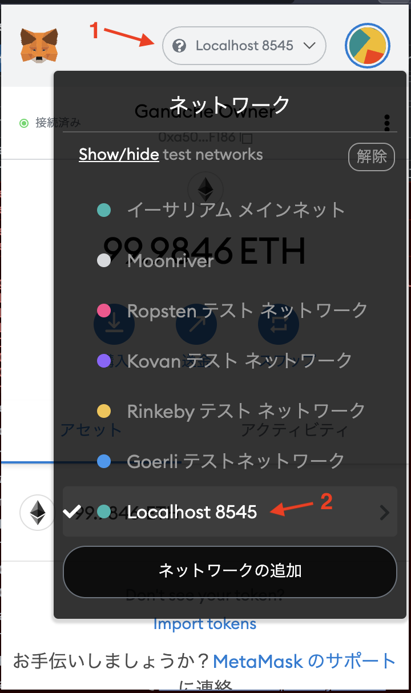
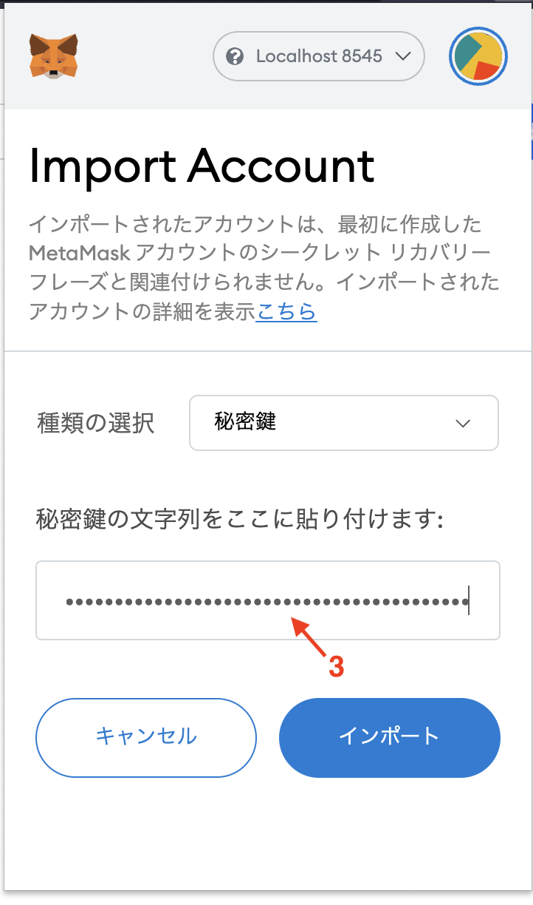
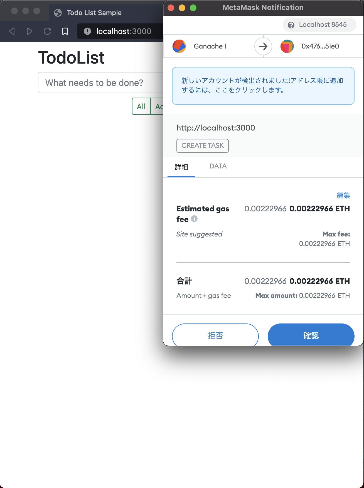
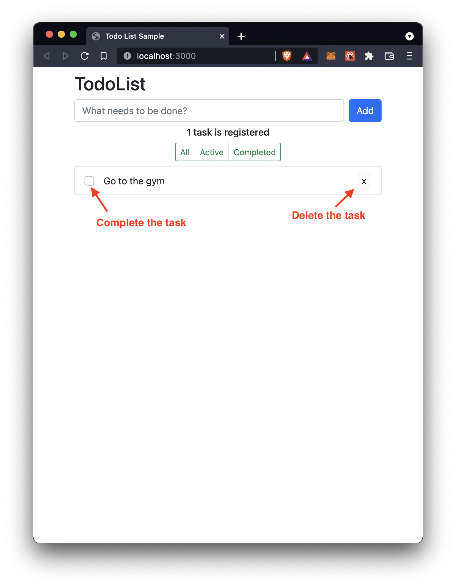

# solidity-todo-sample

## Requirement

```shell
% sw_vers
ProductName:    macOS
ProductVersion: 11.6.1
BuildVersion:   20G224
% docker -v
Docker version 20.10.8, build 3967b7d
```

## Quick start

### 1. Start the local network and the app frontend server

```shell
% git clone https://github.com/tanakaoriginal/solidity-todo-sample.git
% cd solidity-todo-sample
% make setup
% make up
wait a few seconds...
% docker logs ganache
```

After the last command, 10 test accounts and private keys will be displayed.
If not, wait few more seconds and re-run `docker logs ganache`.
Please pickup one private key you like to set up MetaMask.


### 2. Set up [MetaMask](https://metamask.io/) browser extension

#### Install the MetaMask browser extension

[Chrome web store -> MetaMask](https://chrome.google.com/webstore/detail/metamask/nkbihfbeogaeaoehlefnkodbefgpgknn?hl=ja).

#### Connect to localhost:8485 from MetaMask



#### Import a test account

Open the `import account` window. Then set the test private key that you picked up before.

| Account menu | Import Account|
|---|---|
|  |  |

### 3. Deploy the todo smart contract

```shell
% make deploy-ganache
```

After you see the message like below, let's access the todo app.


### 4. Open the Todo App

Open the URL and then connect the app to MetaMask.

```shell
% open http://localhost:3000
```

After you make a task, you can pay the gas fee via MetaMask.

| Make a task | Pay Gas Fee |
|---|---|
| | |

Also you need the gas fee when you complete and delete a task.



### 5. Clean up

If you finished playing the app. You can delte related docker images, volumes, network by running the command.

```shell
% make down
```

## Development

### Setup Hardhat project

```shell
% git clone https://github.com/tanakaoriginal/solidity-todo-sample.git
% cd solidity-todo-sample
% make project
% npm install
```

## Hardhat sample

Hardhat is available on this sample. You can deploy hardhat network with two terminals.

First, boot the hardhat network in terminal-A.

```shell
% make hardhat-node
```

After the hardhat network was booted, you can deploy to the network in terminal-B.

```shell
% make deploy-hardhat
```

## Ganache

Ganache is also available if you would like to persist account data.

Ganache network can be booted with the make command and the data will be created on `volume/ganache/data`.

```shell
% make ganache
```

You can view the persisted balance of the accounts with MetaMask like below. These screenshots were taken after the ganache container was rebooted.

| Account 1 | Account 2 |
|---|---|
|||

Also you can deploy contracts to the Ganache network like Hardhat above.

```shell
% make deploy-ganache
```

## Reference

- [Solidity Docs](https://solidity-jp.readthedocs.io/ja/latest/index.html)
- [Solidity by Example v 0.8.3](https://solidity-by-example.org/)
  - [ethereum/solidity-examples](https://github.com/ethereum/solidity-examples)
- [How to Build Ethereum Dapp with React.js · Complete Step-By-Step Guide](https://www.dappuniversity.com/articles/ethereum-dapp-react-tutorial)
- [drizzleでブロックチェーンTodoアプリを作る](https://qiita.com/hitsuji-haneta/items/5d4f7717335a2887d197#%E3%83%95%E3%83%AD%E3%83%B3%E3%83%88%E3%82%A8%E3%83%B3%E3%83%89%E5%81%B4%E3%81%AE%E6%A7%8B%E7%AF%89)
- [Hardhat | Ethereum development environment for professionals by Nomic Labs](https://hardhat.org/)
  - [Hardhat Tutorial](https://hardhat.org/tutorial/)
  - [MetaMask chainId issue](https://hardhat.org/metamask-issue.html)
  - [Testing with ethers.js & Waffle](https://hardhat.org/guides/waffle-testing.html)
- [trufflesuite/ganache-cli](https://hub.docker.com/r/trufflesuite/ganache-cli/dockerfile)
  - [https://github.com/digitaldonkey/ganache-cli-docker-compose/blob/master/docker-compose.yml](https://github.com/digitaldonkey/ganache-cli-docker-compose/blob/master/docker-compose.yml)
  - [https://github.com/celo-org/ganache-cli/blob/master/Dockerfile](https://github.com/celo-org/ganache-cli/blob/master/Dockerfile)
- [Chai Assertion Library - BDD](https://www.chaijs.com/api/bdd/)
- [Solidity Best Practices for Smart Contract Security](https://consensys.net/blog/developers/solidity-best-practices-for-smart-contract-security/)
- [Bootstrap v5.0 Docs](https://getbootstrap.jp/docs/5.0/getting-started/introduction/)
- [React-Bootstrap Docs](https://react-bootstrap.netlify.app/getting-started/introduction/)
- [Eventにつけるindexedの役割](https://y-nakajo.hatenablog.com/entry/2017/12/08/144643)
- [reentry-attack.sol](https://github.com/raineorshine/solidity-by-example#reentry-attacksol)
